# ventoy-vhd-boot

ventoy实现vhd多系统，以及安装之后的div优化

github:[ventoy-vhd-setting](https://github.com/SGL23187/ventoy-vhd-setting)

## 1.前言

由于本人需要将系统带到机房工作的需求，以及不太希望布置多个系统的环境。因此有了这篇博文，这篇博文旨在记录这段时间对ventoy和vhd装系统的一些感悟，以供未来的我和大家参考。

## 2.准备的工具

### 1.霍格沃兹环境

### 2.一个移动硬盘

用于重装系统或装入ventoy，我使用的是致钛tiplus5000+硬盘盒

### 3.ventoy

官网地址:[Ventoy](https://www.ventoy.net/ "Ventoy")

其他同志写的安装教程：[【windows折腾日记】装系统教学，手把手教怎么制作U盘启动系统盘，Ventoy工具下载和使用_ventoy制作启动u盘-CSDN博客](https://blog.csdn.net/u010560236/article/details/123006741?ops_request_misc=&request_id=&biz_id=102&utm_term=ventoy&utm_medium=distribute.pc_search_result.none-task-blog-2~all~sobaiduweb~default-1-123006741.142%5Ev100%5Epc_search_result_base8&spm=1018.2226.3001.4187 "【windows折腾日记】装系统教学，手把手教怎么制作U盘启动系统盘，Ventoy工具下载和使用_ventoy制作启动u盘-CSDN博客")

### 4.PocketVBox

官网地址:[PocketVBox - Portable VirtualBox](https://pocketvbox.app/)

下载地址:[PocketVBox-2.5.0+7.0.20.7z](https://pocketvbox.app/files/PocketVBox-2.5.0+7.0.20.7z "PocketVBox-2.5.0+7.0.20.7z")

> *PocketVBox 是一款易于使用、功能齐全的便携式 VirtualBox。*

使用PocketVBox，我们可以快速创建vhd，并且带着移动硬盘外出使用时，如果不想要启动系统，也可以虚拟机的形式运行vhd，这样可以省去改bios启动项等麻烦的事情。

### 5.一个全新的win11镜像

镜像站:[原版软件 (itellyou.cn)](https://next.itellyou.cn/Original/Index)

选择最新的win11镜像并下载（比如使用迅雷下载）
也可以选择自己想使用的镜像


## 3.将ventoy安装进入移动硬盘中

打开Ventoy2Disk.exe，在**设备**处选择自己的固态硬盘


分区类型选择MBR


分区设置使用NTFS文件系统


随后返回界面，点击安装


完成后win+R打开运行，输入

> diskmgmt.msc

打开磁盘管理器，可以看到已经制作了一个VTOYEFI的分区用于放置ventoy的文件，另外一个raw分区则是我们用于正常使用的分区，此时将其格式化为NTFS即可


右键此RAW分区，点击格式化，输入卷标点击确认


确认


成功


## 4.个性化Ventoy

ventoy的div要求在第一个分区上创建一个ventoy目录，鉴于我之前已经对ventoy进行了一定的div，因此直接将ventoy目录复制到根目录即可


ventoy中的文件结构为：


**themes**
是ventoy启动的主题

**ventoy.json**
是所有插件的配置文件。

 **ventoy_vhdboot.img**
用于支持直接启动 VHD(x) 文件 （Win7以上）。里面提供了bcd,bootmgr等文件

可以从此处下载到最新：[Releases · ventoy/vhdiso (github.com)](https://github.com/ventoy/vhdiso/releases)

## 5.使用PocketVBox创建vhd

### 1.初始化文件夹环境

右键开始菜单，点击
**Windows PowerShell(管理员)**
或者是
**终端管理员**

输入以下命令，以移动硬盘盘符为E盘为例

```powershell
E:

#创建两个文件夹
New-Item -ItemType Directory -Path 1ProgramFiles -Force
New-Item -ItemType Directory -Path 0ImageFiles -Force

#设置两个软链接文件夹，隐藏属性，指向1ProgramFiles
${path} = "Program Files","Program Files (x86)"
foreach($item in ${path}){
    New-Item -ItemType Junction -Path $item -Value "1ProgramFiles" -Force
    Set-ItemProperty -Path $item -Name Attributes -Value ([IO.FileAttributes]::Hidden)
}

```

键入回车，即可创建好两个隐藏的链接文件夹。

为文件夹设置图标为自己喜欢的图标


> *创建这两个软链接文件夹的目的是为了以后安装软件时，可以直接安装到1ProgramFiles文件夹中，而使用1ProgramFiles文件夹的目的一是为了用"1"来做索引，方便查找，也便于区分，二是为了去掉空格，防止一些命令出问题，建议大家平时也尽量不要在文件夹中使用空格。*

将[PocketVBox-2.5.0+7.0.20.7z](https://pocketvbox.app/files/PocketVBox-2.5.0+7.0.20.7z "PocketVBox-2.5.0+7.0.20.7z")解压，并重命名为PocketVBox，移动到1ProgramFiles文件夹中


### 2.创建vhd并准备安装Windows

运行**PocketVBox.exe**，点击**安装**，直到上面的六个项目都变成 `<font color=green>`R `</font>`后点击**启动**


点击**新建**，并点击**专家模式**


如图配置后点击**完成**


打开powershell，输入以下命令，以移动硬盘盘符为E盘为例

> ```powershell
> $size = 512000
> $dir = "E:\0ImageFiles\Windows11\StorageVHD"
> ${name} = "i","j","k"
> 
> #创建文件夹
> New-Item -ItemType Directory -Path $dir -Force
> Set-Location -Path $dir
> 
> #准备创建命令文本，给diskpart使用
> #创建i_base.vhd,j_base.vhd,k_base.vhd,大小为512GB,动态扩展
> #创建i.vhd,j.vhd,k.vhd,差分于base.vhd
> $command = @()
> foreach($item in ${name}){
>     $command += "create vdisk file=`"$dir\$($item)_base.vhd`" maximum=$size type=expandable noerr"
>     $command += "create vdisk file=`"$dir\$item.vhd`" parent=`"$dir\$($item)_base.vhd`" noerr"
> }
>
> #创建vhd
> $command + "exit" | diskpart
> ```
即可在StorageVHD文件夹中创建三个vhd文件，其中i_base.vhd,j_base.vhd,k_base.vhd为基础文件，i.vhd,j.vhd,k.vhd为差分文件
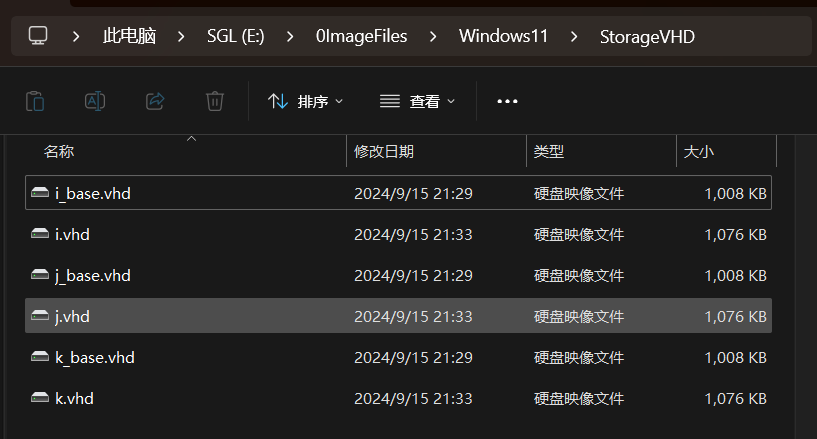

选择**Windows11**，点击**设置**


在储存处加入镜像文件


如图配置后点击**控制器**，点击**添加虚拟硬盘**，点击**注册**


将`xxx_base.vhd`文件和`xxx.vhd`文件都注册进来

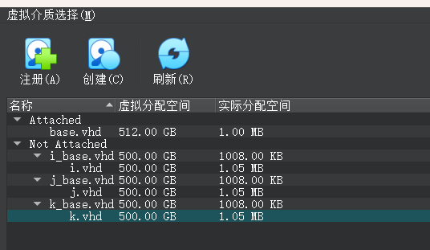

并选择`xxx.vhd`文件，达成如下配置，点击**确定**

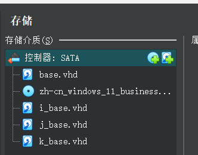


随后即可点击**启动**，提示Press any key to boot from CD or DVD...时按任意键即可。

## 6.安装Windows

点击 `下一页`，点击 `现在安装`

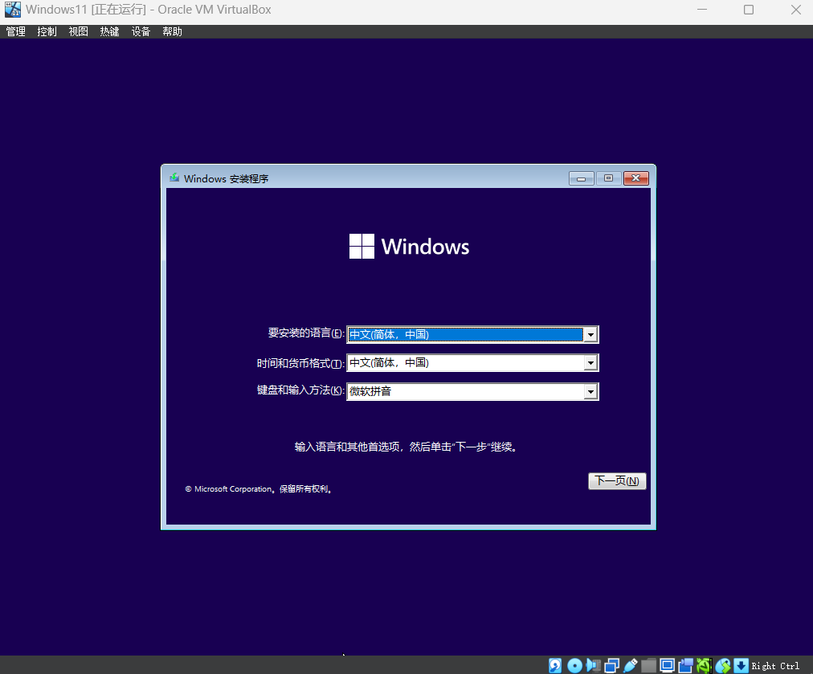

选择Windows11的版本，点击 `下一页`

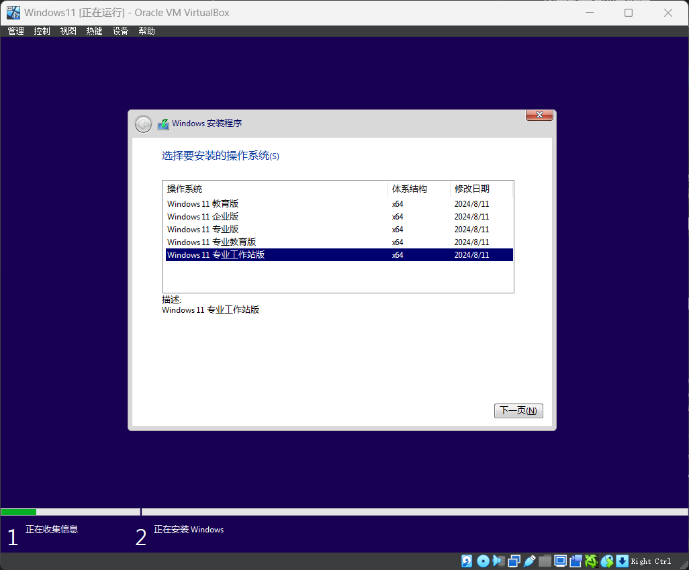

点击 `接受`，点击 `下一页`
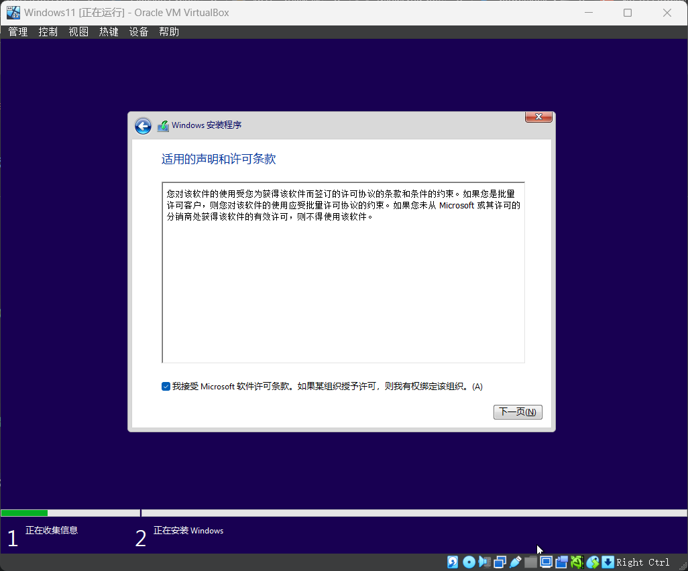

点击 `自定义：仅安装 Windows（高级）`

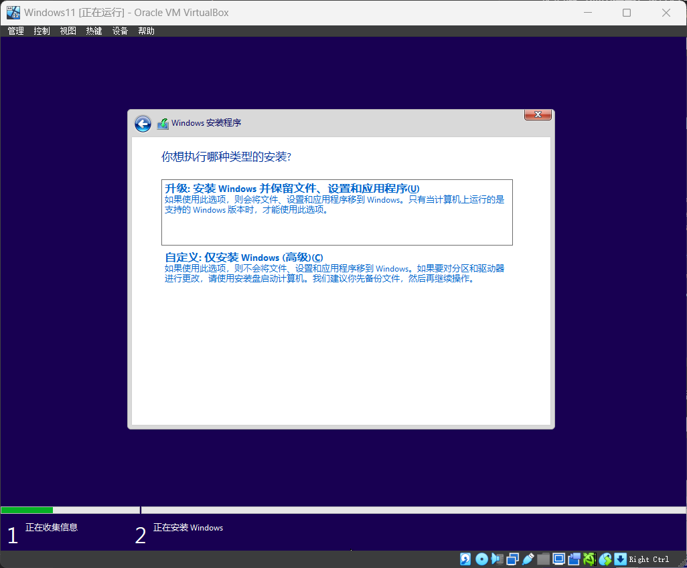

选择**第一个分区**，点击 `新建`，点击 `应用`，点击 `确定`，点击 `下一页`
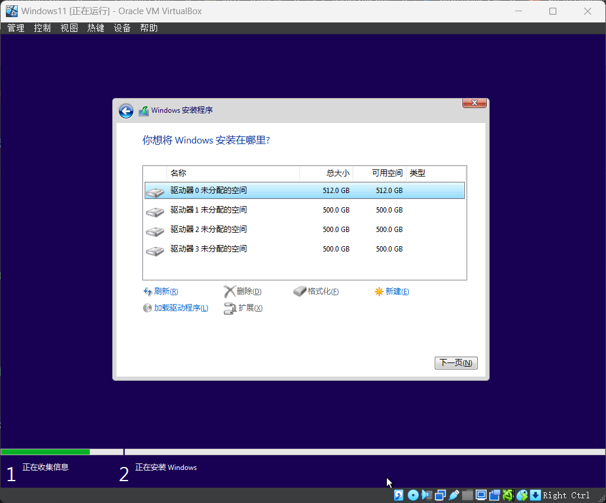


随后即可等待安装完成

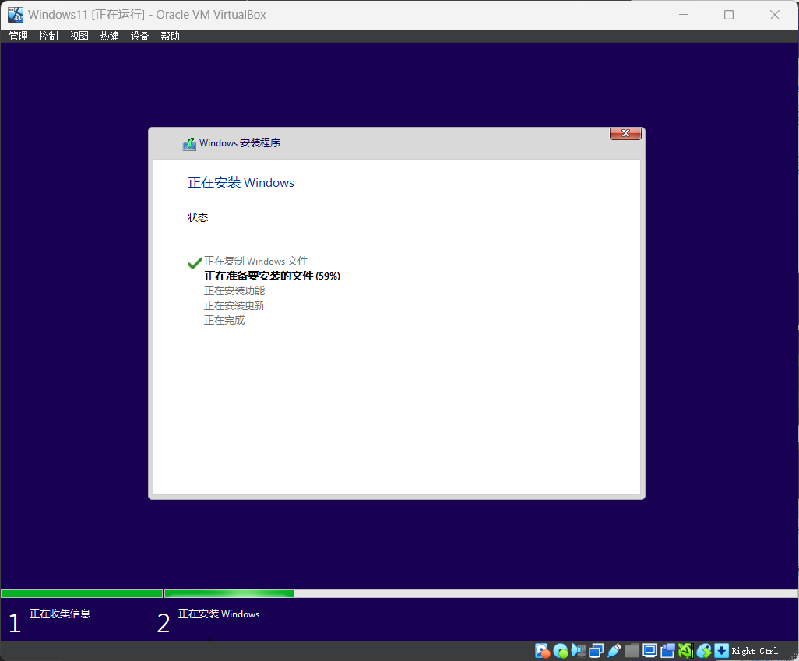


## 7.安装完成后的新系统开荒优化

### 1.OOBE阶段
按`Shift+F10`打开命令提示符，输入以下命令

> ```powershell
> oobe\bypassnro
> ```
并回车，随后虚拟机会自动重启

重启后可以将网络暂时关闭，以防需要输入微软账户

1.设置区域，这里我选择了美国（方便copilot等软件的使用，未来可以修改为中国）


2.设置键盘，点击微软拼音，下一步，然后我点击 `添加布局`，添加了 `英语（美国）`布局，选择了美式键盘，点击添加布局，点击下一步


3.设置网络，由于为我们使用的是虚拟机，不需要设置，直接下一步即可
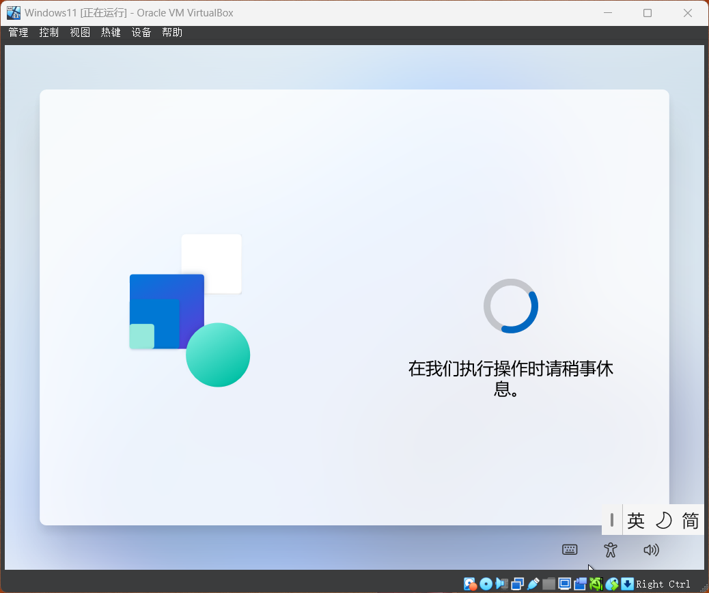

4.设置账户，这里强烈建议使用英文命名，可以避免未来可能出现的一些问题，点击下一步
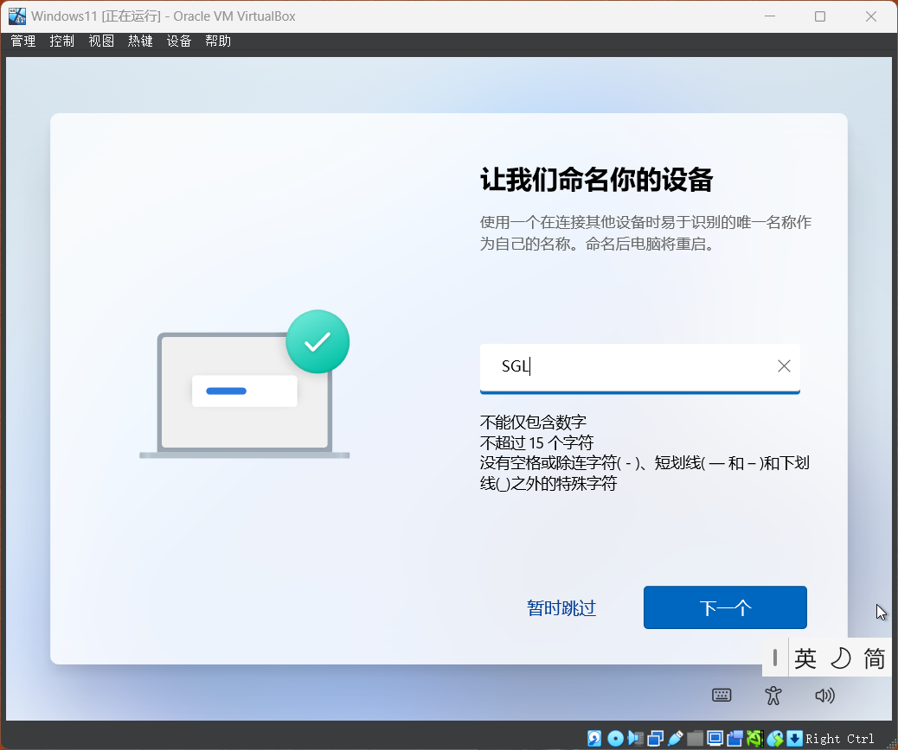

安装成功


### 2.系统设置

#### 1.激活系统
*`(激活系统前记得将之前关闭的网络打开)`*

右键开始菜单，点击**Windows PowerShell(管理员)**,点击**是**

输入以下命令

> ```powershell
> irm https://get.activated.win | iex
> ```


选择HWID激活或KMS激活，这里我选择了KMS38,输入`3`，回车,再输入`1`，回车


激活成功

随后可将此命令保存到记事本中，以便未来使用
---
#### 2.为三个vhd创建NTFS分区

打开Powershell，输入以下命令

```powershell
${letter} = "i","j","k"
#创建命令文本，给diskpart使用   
$command = @()
for($index = 1; $index -le 3; $index++){
    $command += "select disk $index noerr"
    $command += "create partition primary noerr"
    $command += "format fs=ntfs quick noerr"
    $command += "assign letter=${letter}[$index-1] noerr"
}
$command + "exit" | diskpart
```


<!-- 
基础设置

> ```powershell
> #删除defaultuser0
> Get-AppxPackage -AllUsers | where-object {$_.name -like "*defaultuser0*"} | Remove-AppxPackage
>
> #设置右键菜单为小图标
> reg add "HKCU\Software\Microsoft\Windows\CurrentVersion\Explorer\Advanced" /v "TaskbarSmallIcons" /t REG_DWORD /d 1 /f -->
