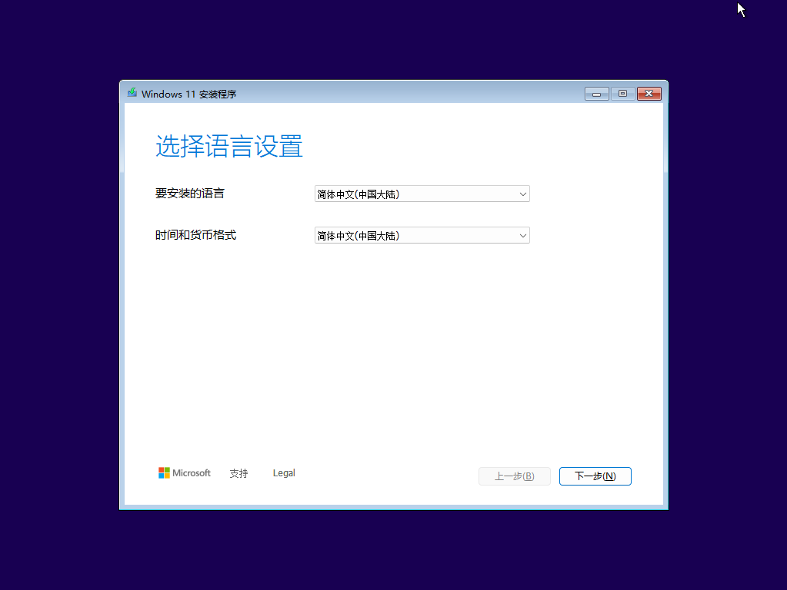

# ventoy-vhd-boot

ventoy实现vhd多系统,以及安装之后的div优化

github:[ventoy-vhd-setting](https://github.com/SGL23187/ventoy-vhd-setting)

## 1.前言

> **<font size=0>2024/09/22: 鉴于作者被亲爱的女友告知,`前言`部分不够白话,特此增加了更详细的说明,以便大家更好的理解。</font>**

由于作者有将系统带到机房工作的需求,因此会出现：家里的电脑和工作机房的系统不同步,以及不太希望在多个Windows系统上重复布置相同的环境。因此有了这篇博文,这篇博文旨在记录这段时间对ventoy和vhd装系统的一些感悟,以供未来的我和大家参考。

> *本文极具个人色彩,**不一定适用于所有人**,多数步骤为了方便,采用了Powershell脚本,在脚本代码中,约定好了一些文件夹的位置,以及一些命名规则,如果你不喜欢这些命名,务必注意**修改脚本中的命令**,以免出现错误。我会尽可能的标注哪些地方可以修改*

### 为什么使用ventoy和vhd创建多系统？

ventoy是一个基于`grub2`开源的U盘启动工具,可以在开机时选择多种系统(vhd,iso等等)启动。不仅可以正常使用,还可以装系统,进PE等"geek"行为。

作为一个计算机专业的学生,我经常需要在Windows系统和Linux系统之间切换,ventoy可以很方便的满足我的需求。

同时,vhd是一种虚拟硬盘,可以在其中安装Windows, Linux等系统。我们使用vhd的好处在于,vhd平时可以当作一个文件,方便备份（*简单的复制,粘贴就可以完成整个系统的转移*）,而且可以在不同的系统中共享,不用担心系统不同步的问题。

vhd中有一个很实用的功能：**差分备份**。差分备份是指在一个基础文件上创建一个差分文件,这个差分文件只记录了基础文件和差分文件之间的差异,因此可以节省很多空间。我们可以在差分文件中安装软件,配置环境,而不用担心基础文件的改变。这就扩展出了以下玩法：

1.**备份**
     - 我们可以将基础系统设置为base.vhd,然后在base.vhd上创建一个差分文件test.vhd,将其复制为test_r.vhd,这样我们就可以在test.vhd中安装软件,配置环境,而不用担心base.vhd的改变。如果我们不小心把test.vhd搞坏了,我们可以直接删除test.vhd,然后将test_r.vhd重命名为test.vhd,这样我们就可以恢复到之前的状态。

2.**转移**
     - 如果我们有两台电脑,共同使用同一个系统。那么我们在电脑A所作的任何改变,只需要将很小的test.vhd复制到电脑B中,就可以在电脑B中看到电脑A的改变。

3.**虚拟机**
     - 如果我们对base.vhd差分为A.vhd和B.vhd,那我们可以在启动A系统的同时,将B.vhd挂载到虚拟机中,这样我们就可以在A系统中同时运行B系统。这样不仅不用重新创建一个虚拟机,可以直接用B系统的环境,还可以节省很多空间。

### 本文使用的Windows差分备份方案

将会生成以下几个vhd文件:
|文件名|备份文件|层级|属性|说明|
|:---:|:---:|:---:|:---:|:---:|
|base.vhd|-|1|只读,隐藏,系统文件|系统安装在base.vhd中,进行简单的配置,优化后就再也不变了|
|bak.vhd|-|2|只读,隐藏,系统文件|实际不会被改变,只用于base和其他xxx_base.vhd的原始备份|
|work_base.vhd|bak.vhd|2|只读,隐藏,系统文件|最稳定的work系统,尽量不要改变|
|game_base.vhd|bak.vhd|2|只读,隐藏,系统文件|最稳定的game系统,尽量不要改变|
|work.vhd|work_r.vhd|3|只读,隐藏,系统文件|经常被merge,但不被直接使用的work系统|
|game.vhd|game_r.vhd|3|只读,隐藏,系统文件|经常被merge,但不被直接使用的game系统|
|work_cache.vhd|-|4|-|随时可能merge到work.vhd的work系统,用于临时存储|
|game_cache.vhd|-|4|-|随时可能merge到game.vhd的game系统,用于临时存储|


### 本文使用的分区方案

我们希望不同系统能尽量使用相同的软件,相同的配置,除了在base.vhd中安装一些必备的软件,我们可以使系统共用一些`分区`,比如`P`盘(stand for Program Files)用于存放所有系统共用的软件,`Q`盘(stand for Quick)用于存放一些临时文件.由于希望跨主机使用,我们可以将`P`盘和`Q`盘等分别打包成vhd文件,并且在不同系统中挂载,还可以随时还原。

- 分区多的好处:
  - 分类的更好,方便管理
  - 不会把单个分区撑爆
  - 还原更快
- 分区多的坏处:
  - 不同分区之间的文件移动会比较麻烦,降低性能

> 分区盘符的选择: 尽量选择字母表靠中的盘符,比如`m`,`n`,`o`等,这样可以避免有一些拥有很多分区的主机上,盘符错乱的问题。
> 默认情况下,C盘是系统盘,D盘为该主机真正的硬盘


为了平衡这两者,作者建议只加上上述的`P`盘和`Q`盘,其他的分区可以根据自己的需求添加。
对于某个vhd是特定用于某个系统的,建议使用`m`,`n`,`o`等盘符,
(以`game系统`为例),那么我们可以创建`game_m.vhd`

将会生成以下几个vhd文件:
|文件名|备份文件|从属系统|层级|属性|说明|
|:---:|:---:|:---:|:---:|:---:|:---:|
|P_base.vhd|-|base.vhd|1|只读,隐藏,系统文件|共用的必备软件,基本不变|
|Q_base.vhd|-|base.vhd|1|只读,隐藏,系统文件|共用的临时文件,基本不变|
|P.vhd|P_r.vhd|base.vhd|2|只读,隐藏,系统文件|经常被merge,但不被直接使用的P盘|
|Q.vhd|Q_r.vhd|base.vhd|2|只读,隐藏,系统文件|经常被merge,但不被直接使用的Q盘|
|P_cache.vhd|-|base.vhd|3|-|随时可能merge到P.vhd的P盘,用于临时存储|
|Q_cache.vhd|-|base.vhd|3|-|随时可能merge到Q.vhd的Q盘,用于临时存储|
| ... | ... | ... | ... | ... | ... |
|game_m_base.vhd|-|game_base.vhd|1|只读,隐藏,系统文件|game系统的必备软件,基本不变|
|game_m.vhd|game_m_r.vhd|game_base.vhd|2|只读,隐藏,系统文件|经常被merge,但不被直接使用的game_m盘|
|game_m_cache.vhd|-|game_base.vhd|3|-|随时可能merge到game_m.vhd的game_m盘,用于临时存储|

> *以上的分区方案是作者的个人建议,不一定适用于所有人,可以根据自己的需求进行调整*

容易发现,这样的设计和上面的vhd备份方案是一致的,我们可以容易地使用相同的代码来创建这些vhd文件。

### C盘的一些软链接设置
由于我们希望恢复系统时尽可能不要丢失用户数据,因此我们可以将一些用户数据放在其他分区中,并且使用软链接的方式将其链接到C盘中,例如将`桌面`,`文档`,`下载`,`APPDATA`等文件夹链接到其他分区中。

### 注意事项

文中包含大量的`powershell`脚本,如果你不熟悉`powershell`,可以直接复制粘贴,但是务必注意以下几点：
    1.脚本中的路径和命名规则,盘符部分,务必根据自己的实际情况修改。其他按需修改。
    2.尽量使用管理员权限运行`powershell`,以免出现权限问题。
        - 按住win键+X,点击`Windows PowerShell(管理员)` (或`终端管理员`)
    3.粘贴时,尽量使用`Ctrl+v`,不要使用鼠标右键粘贴,以免出现错误。

## 2.准备的工具

### 1.霍格沃兹环境

### 2.一个移动硬盘

用于重装系统或装入ventoy,我使用的是致钛tiplus5000+硬盘盒

### 3.ventoy

官网地址:[Ventoy](https://www.ventoy.net/ "Ventoy")

其他同志写的安装教程：[【windows折腾日记】装系统教学,手把手教怎么制作U盘启动系统盘,Ventoy工具下载和使用_ventoy制作启动u盘-CSDN博客](https://blog.csdn.net/u010560236/article/details/123006741?ops_request_misc=&request_id=&biz_id=102&utm_term=ventoy&utm_medium=distribute.pc_search_result.none-task-blog-2~all~sobaiduweb~default-1-123006741.142%5Ev100%5Epc_search_result_base8&spm=1018.2226.3001.4187 "【windows折腾日记】装系统教学,手把手教怎么制作U盘启动系统盘,Ventoy工具下载和使用_ventoy制作启动u盘-CSDN博客")

### 4.PocketVBox

官网地址:[PocketVBox - Portable VirtualBox](https://pocketvbox.app/)

下载地址:[PocketVBox-2.5.0+7.0.20.7z](https://pocketvbox.app/files/PocketVBox-2.5.0+7.0.22.7z "PocketVBox-2.5.0+7.0.20.7z")

> *PocketVBox 是一款易于使用、功能齐全的便携式 VirtualBox。*

使用PocketVBox,我们可以快速创建vhd,并且带着移动硬盘外出使用时,如果不想要启动系统,也可以虚拟机的形式运行vhd,这样可以省去改bios启动项等麻烦的事情。

### 5.一个全新的win11镜像

镜像站:[原版软件 (itellyou.cn)](https://next.itellyou.cn/Original/Index)

选择最新的win11镜像并下载（比如使用迅雷下载）
也可以选择自己想使用的镜像


## 3.将ventoy安装进入移动硬盘中

打开Ventoy2Disk.exe,在**设备**处选择自己的固态硬盘


分区类型选择MBR


分区设置使用NTFS文件系统


随后返回界面,点击安装


完成后win+R打开运行,输入

> diskmgmt.msc

打开磁盘管理器,可以看到已经制作了一个VTOYEFI的分区用于放置ventoy的文件,另外一个raw分区则是我们用于正常使用的分区,此时将其格式化为NTFS即可


右键此RAW分区,点击格式化,输入卷标点击确认


确认


成功


## 4.个性化Ventoy

ventoy的div要求在第一个分区上创建一个ventoy目录,鉴于我之前已经对ventoy进行了一定的div,因此直接将ventoy目录复制到根目录即可


ventoy中的文件结构为：


**themes**
是ventoy启动的主题

**ventoy.json**
是所有插件的配置文件。

 **ventoy_vhdboot.img**
用于支持直接启动 VHD(x) 文件 （Win7以上）。里面提供了bcd,bootmgr等文件

可以从此处下载到最新：[Releases · ventoy/vhdiso (github.com)](https://github.com/ventoy/vhdiso/releases)

## 5.使用PocketVBox创建vhd

### 1.初始化文件夹环境

右键开始菜单,点击
**Windows PowerShell(管理员)**
或者是
**终端管理员**

输入以下命令,以移动硬盘盘符为E盘为例

> ```powershell
> $letter = "E"
>
> #创建三个文件夹
> #0ImageFiles用于存放镜像文件
> New-Item -ItemType Directory -Path "$($letter):\0ImageFiles" -Force
> #1ProgramFiles用于存放软件
> New-Item -ItemType Directory -Path "$($letter):\1ProgramFiles" -Force
> #2Environment用于存放环境变量,以及一些配置文件
> New-Item -ItemType Directory -Path "$($letter):\2Environment" -Force
> #设置两个软链接文件夹,系统属性,隐藏属性,指向1ProgramFiles
> ${paths} = ($letter + ":\Program Files"),($letter + ":\Program Files (x86)")
> foreach($path in ${paths}){
>     (New-Item -ItemType Junction -Path $path -Value "$($letter):\1ProgramFiles" -Force).Attributes = [System.IO.FileAttributes]::Hidden + [System.IO.FileAttributes]::System
> }
> ```

键入回车,即可创建好两个隐藏的链接文件夹。

为文件夹设置图标为自己喜欢的图标


> *创建这两个软链接文件夹的目的是为了以后安装软件时,可以直接安装到1ProgramFiles文件夹中,而使用1ProgramFiles文件夹的目的一是为了用"1"来做索引,方便查找,也便于区分,二是为了去掉空格,防止一些命令出问题,建议大家平时也尽量不要在文件夹中使用空格。*

将[PocketVBox-2.5.0+7.0.20.7z](https://pocketvbox.app/files/PocketVBox-2.5.0+7.0.20.7z "PocketVBox-2.5.0+7.0.20.7z")解压,并重命名为PocketVBox,移动到1ProgramFiles文件夹中


### 2.创建vhd并准备安装Windows

运行**PocketVBox.exe**,点击**安装**,直到上面的六个项目都变成 **<font color=green>R </font>**后点击**启动**


点击**新建**,并点击**专家模式**


如图配置后点击**完成**


打开powershell,输入以下命令,以移动硬盘盘符为E盘为例

> ```powershell
> $size = 1024*1024
> $dir = "E:\0ImageFiles\Windows11\StorageVHD"
> ${name} = "m","n","o"
>
> #创建文件夹
> New-Item -ItemType Directory -Path $dir -Force
> Set-Location -Path $dir
>
> #准备创建命令文本,给diskpart使用
> #创建m_base.vhd,n_base.vhd,o_base.vhd,大小为1TB,动态扩展
> #创建m.vhd,n.vhd,o.vhd,差分于base.vhd
> $command = @()
> foreach($item in ${name}){
>     $command += "create vdisk file=`"$dir\$($item)_base.vhd`" maximum=$size type=expandable noerr"
>     $command += "create vdisk file=`"$dir\$item.vhd`" parent=`"$dir\$($item)_base.vhd`" noerr"
> }
>
> #创建vhd
> $command + "exit" | diskpart
> ```

即可在StorageVHD文件夹中创建三个vhd文件,其中m_base.vhd,j_base.vhd,o_base.vhd为基础文件,m.vhd,n.vhd,o.vhd为差分文件


选择**Windows11**,点击**设置**


在储存处加入镜像文件


如图配置后点击**控制器**,点击**添加虚拟硬盘**,点击**注册**

将 `xxx_base.vhd`文件和 `xxx.vhd`文件都注册进来


并选择 `xxx.vhd`文件,达成如下配置,点击**确定**


随后即可点击**启动**,提示Press any key to boot from CD or DVD...时按任意键即可。

## 6.安装Windows

点击 `下一步`,再点击`下一步`



点击 `以前的版本安装程序`


点击 `下一页`,再点击`现在安装`


勾选 `我接受许可条款`,点击 `下一页`


点击 `自定义`,点击 `下一页`


选择**第一个分区**,点击`下一页`


随后即可等待安装完成


## 7.安装完成后的新系统开荒优化

### 1.OOBE阶段

按 `Shift+F10`打开命令提示符,输入以下命令

> ```powershell
> oobe\bypassnro
> ```

并回车,随后虚拟机会自动重启

重启后可以将网络暂时关闭,以防需要输入微软账户

1.设置区域,这里我选择了美国（方便copilot等软件的使用,未来可以修改为中国）


2.设置键盘,点击微软拼音,下一步,然后我点击 `添加布局`,添加了 `英语（美国）`布局,选择了 `美式键盘`,点击添加布局,点击下一页


3.设置网络,点击 `我没有Internet连接`,点击 `继续执行受限设置`


4.设置账户,这里强烈建议使用英文命名,可以避免未来可能出现的一些问题,点击下一页


5.设置密码（可以不输直接点击下一页）
安装成功


### 2.系统设置

#### 1.安装增强功能

增强功能用于提高虚拟机的性能,包括拖拽文件,共享剪贴板等功能

> *注意,增强功能是安装在client中的,如果以宿主机的方式运行,在插拔设备时会出现 `蓝屏`,报 `VboxMouse.sys`的错,所以在之后当作宿主机之前,需要先删除增强功能。如果单纯作为虚拟机使用,可以不用管*

点击 `设备`,点击 `安装增强功能`


打开virtuabox挂载上去的CD,点击 `VBoxWindowsAdditions`

> *注意,此步骤是在client中进行的,不是在host中进行的*


安装完成后重启即可

#### 2.激活系统

*`(激活系统前记得将之前关闭的网络打开)`*

右键开始菜单,点击**Windows PowerShell(管理员)**,点击**是**

输入以下命令

> ```powershell
> irm https://get.activated.win | iex
> ```


选择HWID激活或KMS激活,这里我选择了KMS38,输入 `3`,回车,再输入 `1`,回车


激活成功


随后可将此命令保存到记事本中,以便未来使用

#### 3.为三个vhd创建NTFS分区

打开Powershell,输入以下命令

> ```powershell
> ${letter} = "m","n","o"
> #创建命令文本,给diskpart使用   
> $command = @()
> for($index = 1; $index -le 3; $index++){
>     $command += "select disk $index"
>     $command += "create partition primary noerr"
>     $command += "format fs=ntfs quick noerr"
>     $command += "assign letter=$(${letter}[$index-1]) noerr"
> }
> $command + "exit" | diskpart
> ```

回车后即可为三个vhd创建NTFS分区


#### 4.基础设置（可选）

打开Powershell,输入以下命令

> ```powershell
> #删除defaultuser0
> Get-AppxPackage -AllUsers | where-object {$_.name -like "*defaultuser0*"} | Remove-AppxPackage
>
> #设置 VirtualDiskExpandOnMount 为 4
> reg.exe add "HKEY_LOCAL_MACHINE\SYSTEM\CurrentControlSet\services\FsDepends\Parameters" /v VirtualDiskExpandOnMount /t REG_DWORD /d 4 /f
>
> #UTC in Windows
> reg.exe add "HKEY_LOCAL_MACHINE\System\CurrentControlSet\Control\TimeZoneInformation" /v RealTimeIsUniversal /d 1 /t REG_DWORD /f
>
> #设置右键默认显示更多
> reg.exe add "HKCU\Software\Classes\CLSID\{86ca1aa0-34aa-4e8b-a509-50c905bae2a2}\InprocServer32" /f /ve
> Stop-Process -Name explorer -Force; Start-Process explorer
>
> #设置蓝牙绝对音量为1
> reg.exe add "\KEY_LOCAL_MACHINE\SYSTEM\ControlSet001\Control\Bluetooth\Audio\AVRCP\CT" /v DisableAbsoluteVolume /t REG_DWORD /d 1 /f
>
> #禁用 Windows 11 搜索要点功能
> reg.exe add "HKEY_CURRENT_USER\Software\Microsoft\Windows\CurrentVersion\SearchSettings" /v IsDynamicSearchBoxEnabled /t REG_DWORD /d 0 /f
>
> #启用「结束任务」选项
> reg.exe add "HKEY_CURRENT_USER\Software\Microsoft\Windows\CurrentVersion\Explorer\Advanced\TaskbarDeveloperSettings" /v TaskbarEndTask /t REG_DWORD /d 1 /f
>
> #启用Windows sandbox
> Enable-WindowsOptionalFeature -Online -FeatureName Containers-DisposableClientVM -All
> n
>
> #卸载 Phone Link 应用
> Get-AppxPackage Microsoft.YourPhone -AllUsers | Remove-AppxPackage
>
> #启用 Windows 11 剪贴板同步
> reg.exe add "HKEY_LOCAL_MACHINE\SOFTWARE\Policies\Microsoft\Windows\System" /v AllowCrossDeviceClipboard /t REG_DWORD /d 1 /f
>
> #显示 Windows 11 文件后缀名
> reg.exe add "HKEY_CURRENT_USER\Software\Microsoft\Windows\CurrentVersion\Explorer\Advanced" /v HideFileExt /t REG_DWORD /d 0 /f
>
> #关闭小组件
> reg.exe add "HKEY_CURRENT_USER\Software\Microsoft\Windows\CurrentVersion\Explorer\Advanced" /v TaskbarDa /t REG_DWORD /d 0 /f
>
> #关闭休眠
> Powercfg -h off
>
>
>
>
>
>
>
>
>
> #卸载Solitaire & Casual Games 应用
> Get-AppxPackage Microsoft.MicrosoftSolitaireCollection -User $env:UserName | Remove-AppxPackage
> Get-AppxPackage Microsoft.3DBuilder -User $env:UserName | Remove-AppxPackage
> #Cortana 应用
> Get-AppxPackage Microsoft.549981C3F5F10 -User $env:UserName | Remove-AppxPackage
> #邮件和日历应用
> Get-AppxPackage Microsoft.WindowsCommunicationsApps -User $env:UserName | Remove-AppxPackage
> #资讯应用
> Get-AppxPackage Microsoft.BingNews -User $env:UserName | Remove-AppxPackage
> #地图应用
> Get-AppxPackage Microsoft.WindowsMaps -User $env:UserName | Remove-AppxPackage
> #Microsoft 365 应用
> Get-AppxPackage Microsoft.MicrosoftgameHub -User $env:UserName | Remove-AppxPackage
> #Microsoft Clipchamp
> Get-AppxPackage Microsoft.Clipchamp -User $env:UserName | Remove-AppxPackage
> #Microsoft Team
> Get-AppxPackage MSTeams -User $env:UserName | Remove-AppxPackage
> #天气应用
> Get-AppxPackage Microsoft.BingWeather -User $env:UserName | Remove-AppxPackage
> #便签应用
> Get-AppxPackage Microsoft.MicrosoftStickyNotes -User $env:UserName | Remove-AppxPackage
> ```

[关闭UAC(用户帐户控制)实现获取管理员权限不弹窗](https://blog.csdn.net/s_ingularity/article/details/142436840)
UserAccountControlSettings.exe

任务栏：

- 设置搜索框为 `仅"搜索"图标`（用 `win+q`或者 `win+s`可以打开搜索）
- 关闭小组件
- 任务栏靠左对齐

系统：
win+q打开搜索,搜索 `系统保护`,点击 `配置`,删除还原点（并限制最大使用量）


---

使用[Dism++](https://github.com/Chuyu-Team/Dism-Multi-language)进行更多优化

---

> *注意：如果系统在真机中出现：**没有WIFI**,**蓝牙**,**声卡**,**分辨率锁800x600**等问题,皆为驱动问题。可以下载专用驱动软件,或根据电脑型号在官网下载驱动,或插上网线（或者使用手机USB共享网络）,检测更新,Windows会自动下载驱动。*

#### 5.设置软链接

设置M盘为日常使用盘,N盘为数据盘,O盘为备份盘

M盘的作用在于承担软件安装,文件下载,以及一些经常使用的文件,N盘的作用在于存储一些长期的为文档,图片,视频等文件,O盘的作用在于备份一些重要的文件,以及备份一些系统文件

打开Powershell,输入以下命令

> ```powershell
> $letter = "M"
>
> #创建两个文件夹
> #1ProgramFiles用于存放软件
> New-Item -ItemType Directory -Path "$($letter):\1ProgramFiles" -Force
> #2Environment用于存放环境变量,以及一些配置文件
> New-Item -ItemType Directory -Path "$($letter):\2Environment" -Force
> #设置两个软链接文件夹,系统属性,隐藏属性,指向1ProgramFiles
> ${paths} = ($letter + ":\Program Files"),($letter + ":\Program Files (x86)")
> foreach($path in ${paths}){
>     (New-Item -ItemType Junction -Path $path -Value "$($letter):\1ProgramFiles" -Force).Attributes = [System.IO.FileAttributes]::Hidden + [System.IO.FileAttributes]::System
> }
> ```

---

#### 6.设置启动检测环境脚本


## 8.设置vhd差分备份

### 1.差分前的准备

将[SDelete](/SDelete)中的文件从仓库复制,或从[官网下载](https://docs.microsoft.com/zh-cn/sysinternals/downloads/sdelete)到C:\Windows\System32中

打开Powershell,输入以下命令

> ```powershell
> sdelete64 -c -z C:
> ```

如果出现以下提示,说明你把SDelete整个文件夹放到了System32中,不要放文件夹,只放文件


等待成功后,即可关闭虚拟机


打开Powershell,输入以下命令

> ```powershell
> $letter = "E"
> $command = @()
> $command += "select vdisk file=`"$($letter):\0ImageFiles\Windows11\Images\base.vhd`""
> $command += "compact vdisk"
> $command | diskpart
> ```

即可对base.vhd进行压缩,以节省空间

### 2.差分备份

借鉴了[Windows Native VHD Boot and Dispatch](https://github.com/lyshie/vhd-boot-dispatch)中的VHD 建立順序

                                                   


打开Powershell,输入以下命令

> ```powershell
> #############################
> #设置变量
> $letter = "D"
> $path = "$($letter):\0ImageFiles\Windows11\Images\"
> #设置要创建的n个档案,以work和game为例
> $archieve = "work","game"
> #############################
>
> Write-Host "该命令将删除除了base.vhd之外的所有vhd文件,是否继续？(y/n)"
> $input = Read-Host
> if($input -ne "y"){
>     exit
> }
>
> #删除除了base.vhd之外的所有vhd文件
> Get-ChildItem -Path $path -Filter "*.vhd" -Force | Where-Object {$_ -notlike "base.vhd"} | Remove-Item -Force
>
> function New-ChildVHD($path,$parent,$child){
>     "create vdisk file=`"$($path)$($child).vhd`" parent=`"$($path)$($parent).vhd`" noerr" | diskpart
> }
> #如果base.vhd不存在,则提示：请先创建base.vhd
> if(!(Test-Path "$($path)base.vhd")){
>     Write-Host "请先创建base.vhd"
>     exit
> }
>
> #创建bak.vhd
> New-ChildVHD -path $path -parent "base" -child "bak"
> foreach($item in $archieve){
>   #复制获得xxx_base.vhd
>   Copy-Item -Path "$($path)bak.vhd" -Destination "$($path)$($item)_base.vhd" -Force
>   #创建xxx.vhd
>   New-ChildVHD -path $path -parent "$($item)_base" -child $item
>   #复制获得xxx_r.vhd
>   Copy-Item -Path "$($path)$($item).vhd" -Destination "$($path)$($item)_r.vhd" -Force
>   #创建xxx_cache.vhd
>   New-ChildVHD -path $path -parent "$($item)" -child "$($item)_cache"
> }
> #将部分vhd设置为只读,隐藏,系统文件
> $files = @("base","bak") + ($archieve | ForEach-Object {$_,"$($_)_base","$($_)_r"})
> foreach($item in $files){
>     (Get-Item -Path "$($path)$($item).vhd" -Force).Attributes = [System.IO.FileAttributes]::ReadOnly + [System.IO.FileAttributes]::Hidden + [System.IO.FileAttributes]::System
> }
> ```

即可初始化差分

## 9.使用powershell脚本进行日常操作