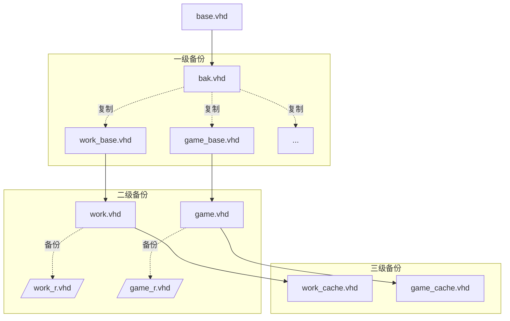

# vhd-diff-system

## 项目简介

`vhd-diff-system` 是一个用于生成和管理基于 `base.vhd` 的差分 VHD 文件的 PowerShell 项目。该项目旨在简化 VHD 文件的创建、压缩和管理过程，适合需要在多个系统间共享和备份环境的用户。

## 文件结构

```
vhd-diff-system
├── src
│   ├── New-DiffVHD.ps1        # 生成差分VHD文件的脚本
|   ├── Get-VHDInfo.ps1        # 获取VHD文件信息的脚本
│   ├── Initialize-Environment.ps1 # 初始化环境的脚本
│   ├── Compress-VHD.ps1       # 压缩VHD文件的脚本
│   └── VHDModule.psd1         # PowerShell模块清单文件
├── VHDModule.psm1             # PowerShell模块实现文件
├── .gitignore                  # 版本控制忽略文件
└── README.md                   # 项目文档
```

## 安装步骤

1. **克隆项目**

   使用以下命令克隆项目到本地：

   ```
   git clone https://github.com/yourusername/vhd-diff-system.git
   ```

2. **进入项目目录**

   ```
   cd vhd-diff-system
   ```

3. **使用模块**

   导入模块并使用相关功能：

   ```powershell
   Import-Module .\VHDModule.psm1
   ```

## 使用方法

### 基于 `base.vhd` 创建差分新系统

```powershell
New-DiffVHD -VHDPath "{base.vhd文件夹的路径}" -NewVHDName "{新系统的名称}"
```

- VHDPath: base.vhd文件夹的路径
- NewVHDName: 新系统的名称

#### 示例

```powershell
New-DiffVHD -VHDPath "C:\VHDs" -NewVHDName "NewSystem"
```

将会在 `C:\VHDs` 目录下创建:
   - `bak.vhd`：备份文件(如果存在, 则不会创建)
   - `NewSystem_base.vhd`：基础VHD文件
   - `NewSystem.vhd`：新系统的VHD文件
   - `NewSystem_r.vhd`：新系统的恢复文件
   - `NewSystem_cache.vhd`：新系统的缓存文件

> 由于base.vhd, bak.vhd, NewSystem_base.vhd, NewSystem.vhd, NewSystem_r.vhd文件都是只读,隐藏,系统文件,所以在文件管理器中默认不会显示,如果需要查看,请在文件管理器中显示隐藏文件和系统文件


本文使用的Windows差分备份方案将会生成以下几个vhd文件:
|文件名|备份文件|层级|属性|说明|
|:---:|:---:|:---:|:---:|:---:|
|base.vhd|-|1|只读,隐藏,系统文件|系统安装在base.vhd中,进行简单的配置,优化后就再也不变了|
|bak.vhd|-|2|只读,隐藏,系统文件|实际不会被改变,只用于base和其他xxx_base.vhd的原始备份|
|work_base.vhd|bak.vhd|2|只读,隐藏,系统文件|最稳定的work系统,尽量不要改变|
|game_base.vhd|bak.vhd|2|只读,隐藏,系统文件|最稳定的game系统,尽量不要改变|
|work.vhd|work_r.vhd|3|只读,隐藏,系统文件|经常被merge,但不被直接使用的work系统|
|game.vhd|game_r.vhd|3|只读,隐藏,系统文件|经常被merge,但不被直接使用的game系统|
|work_cache.vhd|-|4|-|随时可能merge到work.vhd的work系统,用于临时存储|
|game_cache.vhd|-|4|-|随时可能merge到game.vhd的game系统,用于临时存储|





工具将首先检测是否存在 `base.vhd` 文件，如果不存在则会提示用户路径错误并退出。如果存在，则会检测是否存在 `bak.vhd` 文件，如果不存在则将 `base.vhd` 差分到 `bak.vhd` 文件中。如果存在，则直接复制 `bak.vhd` 文件到 `work_base.vhd` 和 `game_base.vhd` 文件中。

### 获取某系统的信息

```powershell
Get-VHDInfo -VHDPath "{vhd文件夹的路径}" -VHDName "{系统的名称}"
```

- VHDPath: vhd文件夹的路径
- VHDName: 系统的名称

#### 示例

```powershell
Get-VHDInfo -VHDPath "C:\VHDs" -VHDName "NewSystem"
```

将会返回:
   - `NewSystem_base.vhd` 的信息
   - `NewSystem.vhd` 的信息
   - `NewSystem_r.vhd` 的信息
   - `NewSystem_cache.vhd` 的信息

